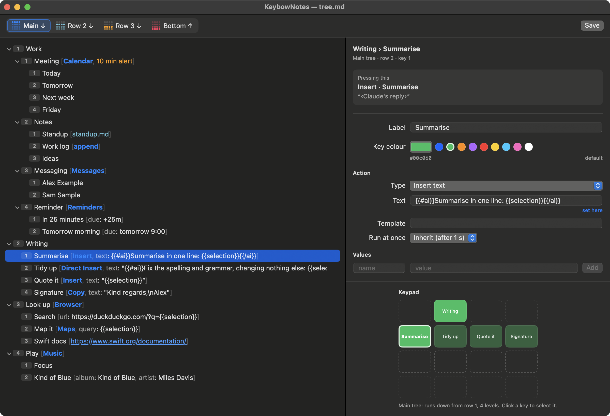
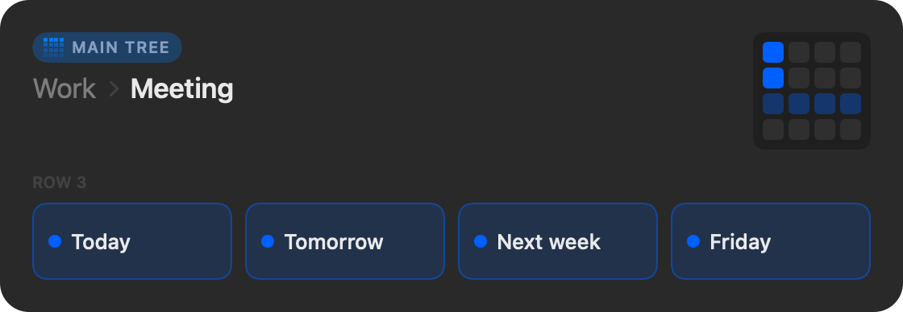
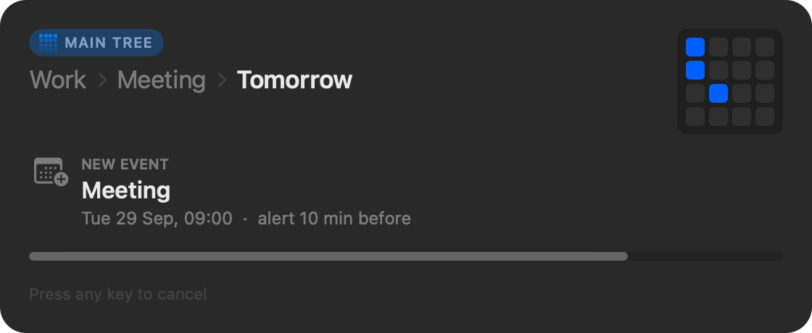
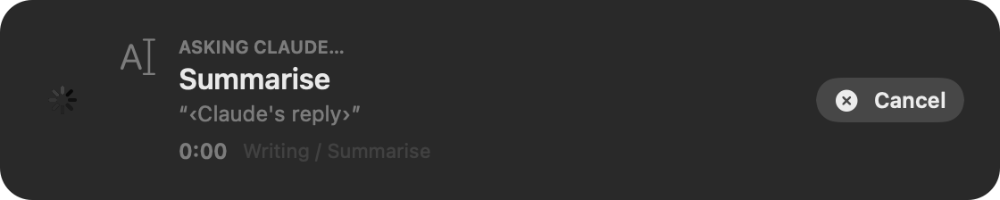
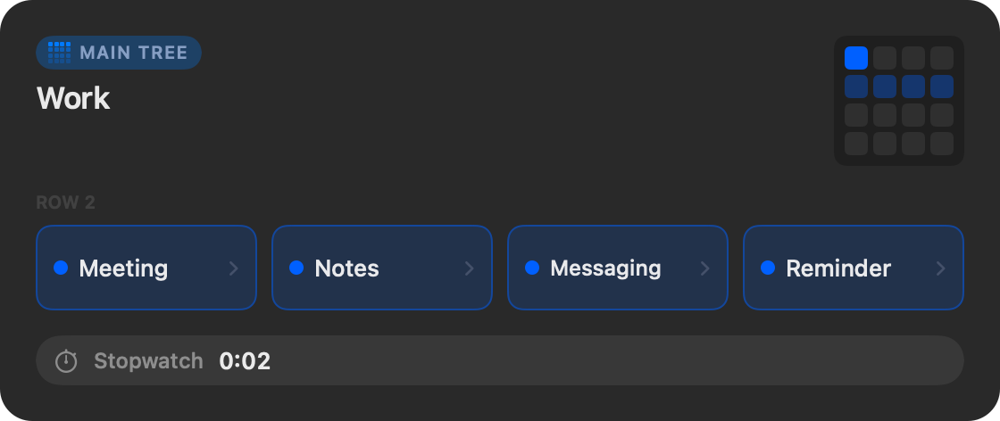
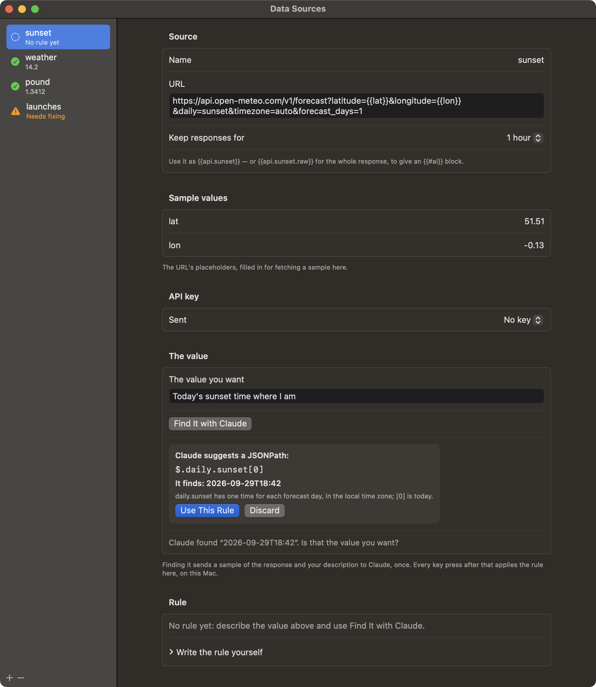
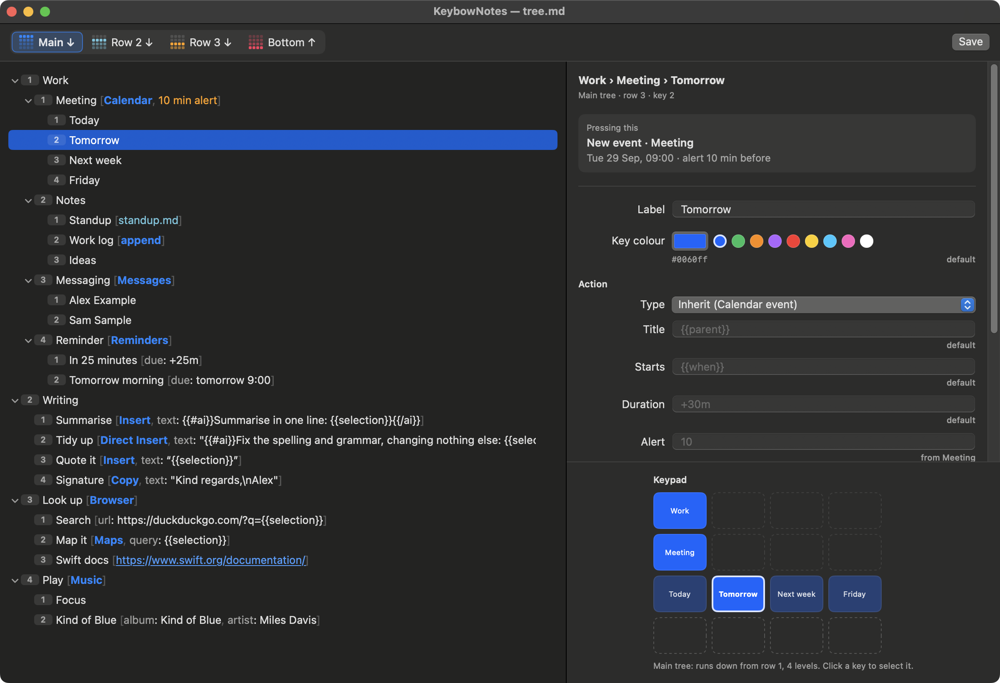

# KeybowNotes

A 16-key macro pad and a Mac menu-bar app that turn two or three key presses into
a note, a calendar event, a message, a snippet of text typed where you are — or a
question to Claude.

The keypad is a [Pimoroni Keybow 2040](https://shop.pimoroni.com/products/keybow-2040)
or a Raspberry Pi Pico on Pimoroni's [RGB Keypad Base](https://shop.pimoroni.com/products/pico-rgb-keypad-base):
a 4 × 4 grid of lit keys. You arrange what you want to do as a tree, four keys to
a row. Pressing a key picks a branch; its choices light up on the next row, and a
heads-up display on the Mac shows where you are. Choosing a leaf runs its action.



*Work → Meeting → Tomorrow* makes a calendar event called "Meeting" for tomorrow at
9:00, with an alert, and opens it ready to edit. *Writing → Summarise* asks Claude
to summarise the text you've selected, and types the reply in its place.

## The heads-up display

While you choose, the HUD follows along: the path so far, the choices on offer,
and a copy of what the keys are showing. When you reach a leaf there's a moment to
change your mind — press any key — before the action runs.

| Choosing | About to run |
|---|---|
|  |  |
| **Waiting for Claude** | **With a stopwatch running** |
|  |  |

## Features

**Actions** — each leaf does one thing:

- **Notes**: a new note, filed in folders that mirror the tree, or an entry added
  to a running note. Templates in Markdown become Notes formatting.
- **Calendar and Reminders**: events and reminders from plain dates — *today*,
  *tomorrow 14:00*, *friday*, *+25m* — with alerts; a reminder due in 25 minutes
  makes a handy timer.
- **Messages and Mail**: a message or email ready to send — never sent for you.
- **Calls**: a phone call through your iPhone, or FaceTime audio.
- **Apps, files and links**: open an app, a file in an app, a web page, or any
  app's own link — a Discord channel, a Things project.
- **Maps, Music, Clock**: search Maps, play a playlist or an album, start a timer.
- **Shortcuts**: run any shortcut, with text as its input.
- **Text**: copy a snippet to the clipboard, or type it at the cursor in whatever
  app you're using — by pasting, or directly, without touching the clipboard.
- **Stopwatch**: start, stop, lap and reset from the keys; it shows in the HUD and
  the menu bar, and its key breathes while it runs.
- **Display**: show a template or text on screen — a quote, today's notes, a status
  page — in a panel sized to fit, Markdown or HTML. It fades by itself, or waits
  for OK or Cancel, and each can run an action of its own: copy what was shown,
  file it as a note.
- **Ask**: a question with a field to type in, whose answer goes to an action of
  your choosing — a search, a note, text typed where you were.
- **Windows**: put the window you're working in on a half or a quarter of the
  screen, fill it, or send it to another screen.
- **Home Assistant**: switch and dim lamps, set the heating, run scenes — and
  any sensor's reading is a value: *It's 14.2 °C outside*.

**Values** — anything an action writes can include `{{placeholders}}`: the labels
along the path, a contact's number, the date in any format, **where your Mac is**,
the **text selected in the app you're using**, the clipboard, or a **quote from a
file** — a paragraph or list item picked at random or in turn, for a quote of the
day, a writing prompt or the next thing on a reading list. `{{selection}}` makes a key that looks up,
quotes, files or rewrites whatever you've highlighted.

**Ask Claude** — a template can hold `{{#ai}}…{{/ai}}` blocks. The text inside is
filled in and sent to Claude, and the reply takes the block's place:

```
Summarise [Insert, text: "{{#ai}}Summarise in one line: {{selection}}{{/ai}}"]
```

Blocks nest, and those side by side are asked at once. While you wait, the HUD
shows a timer and a Cancel button. Blocks aren't allowed where a reply could decide
where an action goes — links, phone numbers, apps — so text you select can't steer
it there. Claude Opus 5.5 at low effort by default; your API key stays in the
Keychain.

Copy a screenshot, an image or a PDF, and `{{clipboard}}` sends it to Claude as
itself — *What does this error mean? {{clipboard}}*. Replies come back in
Markdown, and Copy and Insert paste them formatted into Mail, Notes or Pages.

**Values from APIs** — bring a live value from a web API into whatever a key writes
or opens: the temperature, an exchange rate, the next train, a parcel's status. In
*Data Sources*, from the menu bar, give the API's address and its key if it needs
one, then describe the value you want in your own words — *today's sunset time where
I am*. Claude reads a sample of the response and writes a rule that finds the value —
a JSONPath, an XPath or a regular expression — which the app tries on the sample
before showing you what it finds.



That's the only time Claude is asked. From then on, each key press fetches the API
and applies the rule on your Mac — no model in the loop, and responses kept for as
long as you choose:

```
1. Outside [lat: 51.51, lon: -0.13]
   1. Sunset [Insert, text: "Sunset today: {{api.sunset}}"]
```

The URL's placeholders — `{{lat}}` and `{{lon}}` here — come from the tree, like any
other value. Use `{{location.latitude}}` and `{{location.longitude}}` in the URL
instead, and the source follows your laptop about. A fetched value may go in a link or a phone number, since a fixed rule
picks it, not a model. If the API changes and the rule stops finding its value, the
key says so, the menu bar flags the source, and Claude can find it again from your
description. API keys stay in the Keychain and go only to their own API.

**Four trees** — the row you press first chooses the tree: row 1 runs down through
all four rows, rows 2 and 3 are shorter trees of their own, and row 4 runs upwards.
Four menus on one keypad, with the top row always a way back to the main one.

**Pages** — the main, row 2 or row 3 tree can be pages instead, as on a macro
pad: each key on its row picks a page, which stays, and the rows below become
that page's keys, lit in its colour, each doing its one thing the moment it's
pressed. A key on a row above goes back to the trees. `# row 2 [pages]` in the
outline, or the *Pages* checkbox in the editor.

**Several keypads** — plug in more than one, and each can have trees of its own:
a `# keypad Desk [RGB Keypad]` section of the outline, chosen by model or by the
board's unique ID, and a tab of its own in the tree editor. Without one, every
keypad shares the same trees.

**Setting keypads up** — *Set Up a Keypad…* puts CircuitPython and the firmware on
a new keypad, or brings one up to date: it fetches the newest CircuitPython the
firmware supports, restarts the board into its bootloader by itself when it can,
and copies the firmware that comes with the app. `keybow setup` does the same
from Terminal.

**The tree editor** — the tree is a plain outline file, `tree.md`, and the editor
is an outliner for it: Return, Tab and Shift-Tab to add and arrange nodes, a
settings pane with a tooltip on every field, and the keypad drawn as it will light
up. Nodes cut, copy and paste — several at once, between trees and keypads —
as outline text. Colours, templates, contacts and values are all set there, and anything a node
has that does nothing is flagged, with a button to remove it.



**Modules** — the stopwatch, the Claude blocks, data sources, location, quotes, displays, Ask, window moving and Exposé are modules: separate code that
plugs in through one interface, adding actions, template blocks, values, settings
and menu commands. See [docs/MODULES.md](docs/MODULES.md).

## How it fits together

- **[firmware/](firmware/)** — CircuitPython for the Keybow 2040 and the RGB
  Keypad. The keypad only reports key presses and shows the colours it's told
  to, over a USB serial port of its own.
- **[mac/](mac/)** — a Swift package: the menu-bar app, the tree editor, the core
  library, a `keybow` command-line tool, and the modules. Everything that decides
  what a key means lives here, on the Mac.
- **[docs/](docs/)** — the design, the configuration language, the editor, and
  the module interface.

## Requirements

- A **Pimoroni Keybow 2040**, or a **Raspberry Pi Pico** on Pimoroni's **RGB
  Keypad Base** — or several — running CircuitPython with Pimoroni's `pmk`
  library.
- A Mac with **macOS 15 Sequoia** or later — Apple silicon or Intel.
- **Xcode 16** or later to build it (Swift 6).
- Optional: an **Anthropic API key** for `{{#ai}}` blocks, and an **iPhone** on
  the same Apple Account for calls.

## Getting started

1. **Build and install the app** — from the `mac` folder:

   ```bash
   scripts/build-app.sh --install
   ```

   This builds a universal app, signs it with your Apple Development identity if
   you have one (so macOS remembers the permissions you grant), and copies it to
   `/Applications`. More in [mac/README.md](mac/README.md).
2. **Open KeybowNotes.** A keyboard icon appears in the menu bar, and the first
   launch installs an example tree in `~/Library/Application Support/KeybowNotes`.
3. **Set up the keypad** — plug it in and choose *Set Up a Keypad…* from the menu
   bar. It installs the newest CircuitPython the firmware supports, then the
   firmware, and restarts the keypad; any files it replaces are backed up first.
   To do it by hand instead, see [firmware/README.md](firmware/README.md).
4. **Make the tree your own** — choose *Edit Tree…* from the menu bar (⌘E). The
   language is described in [docs/CONFIG-LANGUAGE.md](docs/CONFIG-LANGUAGE.md),
   and every field in the editor explains itself.
5. **Try things safely** — *Dry Run* in the menu shows what a key would do without
   doing it.

## When a keypad isn't found

*Set Up a Keypad…* brings in a troubleshooter by itself when no keypad turns up,
and *Find a Missing Keypad…* in the menu bar — or *Find It…* beside a missing
keypad in Settings — opens it any time. It works out what's wrong on its own, with
no AI or account needed: it reads what's plugged in and what macOS's USB log says
happened, watches while you unplug the keypad and plug it back in, and asks what
its keys are doing. Then it says what to do: a cable that only charges, a hub
that's given up and switched its ports off, a port another program has open, a
keypad in its bootloader or safe mode, firmware that needs a restart or
reinstalling. *Copy Report* puts everything it found on the clipboard, for anyone
helping.

## Permissions

macOS asks the first time each is needed:

| For | Permission |
|---|---|
| Notes, Mail, Music | Automation — control of that app |
| Calendar events and reminders | Calendars, Reminders |
| `{{selection}}`, typing text into other apps, and moving windows | Accessibility |
| Looking people up in the editor | Contacts |
| `{{location}}`, where your Mac is | Location Services |
| Setting a keypad up | Files on a removable volume: the keypad's drive |

The app isn't sandboxed and isn't on the App Store: driving Notes, Mail and Music
through AppleScript rules that out.

## Documentation

- [docs/DESIGN.md](docs/DESIGN.md) — how it works, and why
- [docs/CONFIG-LANGUAGE.md](docs/CONFIG-LANGUAGE.md) — the tree, actions, values,
  templates and `{{#ai}}` blocks
- [docs/TREE-EDITOR.md](docs/TREE-EDITOR.md) — the editor, its keys and its panes
- [docs/MODULES.md](docs/MODULES.md) — the module interface, the stopwatch and
  Claude
- [firmware/README.md](firmware/README.md) — the keypad's side and its protocol
- [mac/README.md](mac/README.md) — building, running and testing the Mac side

## Licence

MIT — see [LICENSE](LICENSE).
